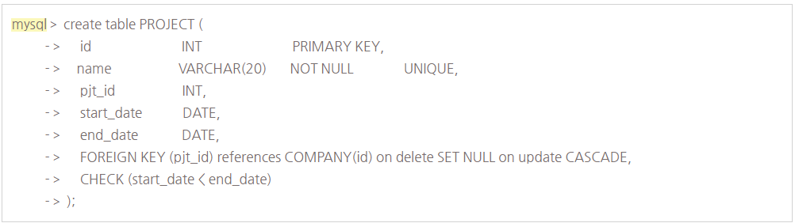
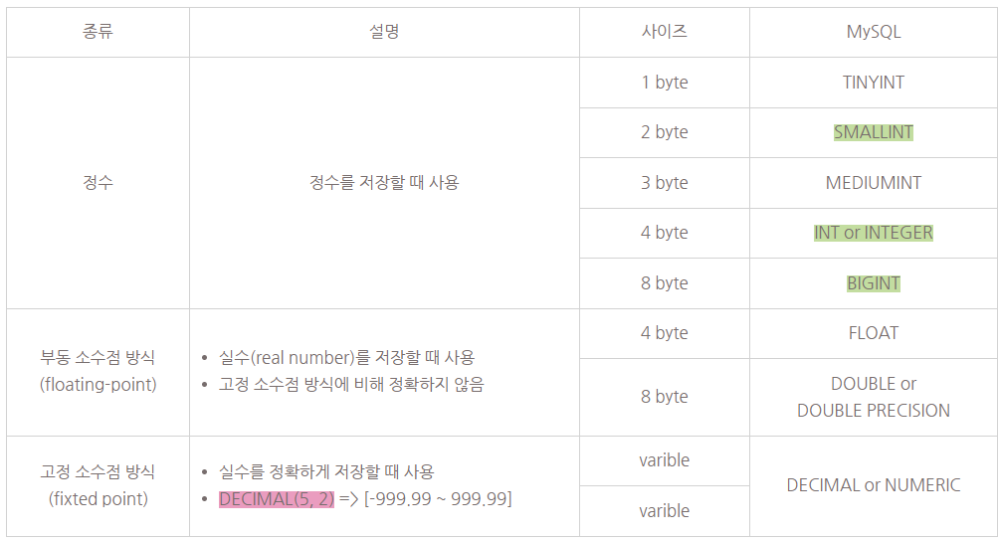
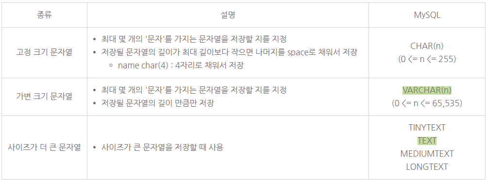
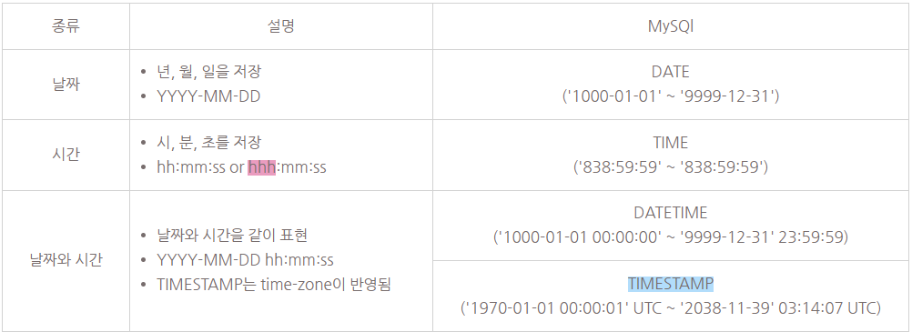
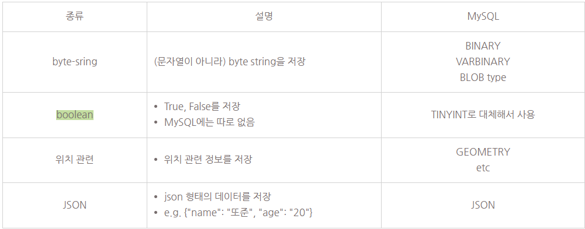
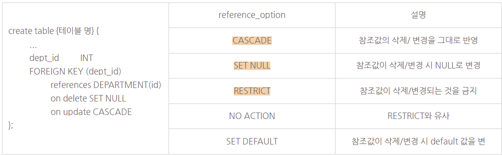
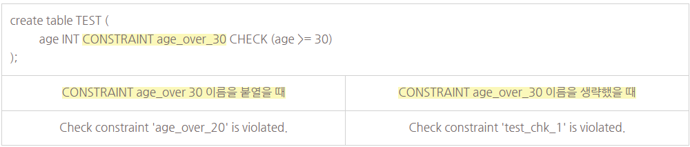
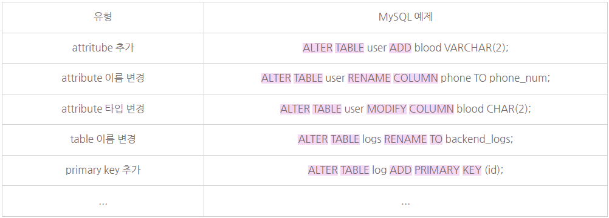

### Structured Query Language
: relational DBMS의 표준 언어<br>
&nbsp;&nbsp;종합적인 DB 언어 : DDL + DML + VDL

------------

### SQL에서 relation이란?
: multiset(== bag) of tuples of @ SQL<br>
&nbsp;&nbsp;중복된 tuple을 허용한다.

------------

### SQL & RDBMS
: SQL은 RDBMS의 표준 언어이지만, 실제 구현에 강제가 없기 때문에 RDBMS마다 제공하는 SQL의 스펙이 조금씩 다르다.<br>
&nbsp;&nbsp;즉, 100% 호환이 되지 않는다<br>
&nbsp;&nbsp;(MySQL, Oracle, PostgreSQL, MS SQL)

------------

### Database 정의
mysql＞ SHOW DATABASES;<br>
mysql＞ CREATE DATABASE {데이터베이스 명};<br>
mysql＞ SELECT {데이터베이스 명};<br>
mysql＞ USE {데이터베이스 명};<br>
mysql＞ DROP DATABASE {데이터베이스 명}

```
Database VS Schema
- MySQL에서는 Database와 Schema가 같은 뜻을 의미
- CREATE DATABASE {데이터베이스 명} == CREATE SCHEMA {데이터베이스 명}
- 다른 RDBMS에서는 의미가 다르게 쓰임
- i.g. PostgreSQL에서는 SCHEMA가 DATABASE의 namespace를 의미
```
mysql＞ create table {테이블 명} (Attribue name, Data type, features,  etc);



------------

### Attribute data type : 숫자


###### PostgreSQL에는 (SMALLINT) ,  (INT or INTEGER) , (BIGINT) 만 있음
###### DECIMAL(precision, scale) : precision은 전체 숫자 몇자리인지, scale : 소수점 이하 몇자리까지 표현할 것인지

------------

### Attribute data type : 문자열

###### PostgreSQL 공식 문서에서는 VARCHAR(n) 권장 하고 있고,  TEXT 만 있음

------------

### attribute data type : 날짜와 시간

###### 경과된 시간을 표시하고 싶을때 3자리로 표현 (24시간을 넘어갈 수 있다.)
###### TIMESTAMP의 경우 UTC로 저장을 한다. (UTC; 표준 시간대, time-zone에 영향을 받음)

------------

### attriubte data type : 그 외

###### PostgreSQL에는 boolean 있음

----------

- Key constraints
  - PRIMARY KEY
    - primary key : table의 tuple을 식별하기 위해 사용, 하나 이상의 attribute(s)로 구성
    - primary key는 중복된 값을 가질 수 없으며, NULL 값도 가질 수 없다.
  - UNIQUE
    - unique로 지정된 attribute(s)는 중복된 값을 가질 수 없다.
    - 단, NULL은 중복을 허용할 수도 있다. (RDBMS마다 다름)
  - NOT NULL constraints
    - attribute가 NOT NULL로 지정되면 해당 attribute는 NULL을 값으로 가질 수 없다.
  - Attribute DEFAULT
    - attribute의 default 값을 정의할 때 사용
    - 새로운 tuple을 저장할 때 해당 attribute에 대한 값이 없다면 default 값으로 저장
  - CHECK constraint
    - attribute의 값을 제한하고 싶을 때 사용
  - Referential integrity constraint : FOREIGN KEY
    - attribute(s)가 다른 table의 primary key나 unique key를 참조할 때 사용
    - FOREIGN KEY를 선언하는 방법은 아래와 같다.


###### MySQL에는 (CASCADE) , (SET NULL) , (RESTRICT) 지원
###### PostgreSQL에는 전부 지원

----------

- constraint 이름 명시하기
  - 이름을 붙이면 어떤 constraint을 위반했는 지 쉽게 파악 가능
  - constraint를 삭제하고 싶을 때 해당 이름으로 삭제 가능



----------

### ALTER TABLE
- table의 schema를 변경할고 싶을 때 사용



###### 이미 서비스 중인 table의 schema를 변경하는 것이라면, 변경 작업 때문에 서비스의 BE에 영향이 없을지 검토한 후 변경하는 것이 중요

------------

### DROP TABLE
- table을 삭제할 때 사용
- DROP TABLE {테이블 명};

------------

### Database 구조를 정의할 때 중요한 점
- 개발자로서 만들려는 회사/팀 서비스의 스펙과 데이터 일관성, 편의성, 확장성 등 종합적으로 고여하여 DB 스키마를 적절하게 정의하는 것이 중요!